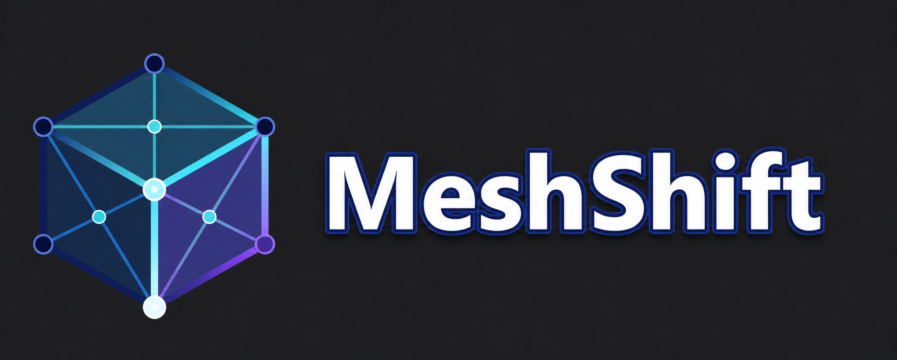

# MeshShift

MeshShift is an offline 3D model converter and optimizer for Windows, macOS,
and Linux. Download the latest desktop release, open the application, and
convert your models locally—no Node.js installation, account, or upload is
required.

## Download MeshShift

Get the latest version from [GitHub Releases](https://github.com/H445/MeshShift/releases/latest).

- **Windows:** download the `.exe` installer.
- **macOS:** download the `.dmg` for your Mac: Apple Silicon (`arm64`) or Intel
  (`x64`).
- **Linux:** download the `.AppImage`, make it executable if needed, and run it.

The release page also includes SHA256 checksums. MeshShift runs offline after
installation; no model is uploaded to a remote service and your model files
stay on your computer.

## Quick start

1. Install or launch MeshShift.
2. Choose a model in **Choose files**. For glTF or OBJ files, select the
   referenced `.bin`, `.mtl`, and texture files with it.
3. Select an output format in **Settings**.
4. Optionally configure LOD generation in **Profiles**.
5. Click **Convert all**.

Converted files are saved automatically. Open **Settings → Export location** to
see or change the folder. The default is an `exports` folder beside the
installed application when that location is writable.

For a visual walkthrough, see [Using MeshShift](docs/HOW_TO_USE.md).

## Supported formats

| Direction | Formats                                                             |
| --------- | ------------------------------------------------------------------- |
| Input     | GLB, glTF, FBX, OBJ, STL, PLY, Collada (`.dae`), 3D Studio (`.3ds`) |
| Output    | FBX, GLB, glTF, OBJ, STL, PLY, Collada (`.dae`)                     |

MeshShift can generate lower-detail LOD meshes, preserve selected detail pins,
and reproject textures onto generated UV layouts.

## Documentation

### For users

- [Quick start](docs/QUICK_START.md)
- [Using MeshShift](docs/HOW_TO_USE.md)
- [LOD and optimization guide](docs/LOD.md)
- [Format and feature support](docs/FORMAT_FEATURE_MATRIX.md)
- [Browser and platform compatibility](docs/BROWSER_COMPATIBILITY_MATRIX.md)

### For developers

Start with the [Developer guide](docs/DEVELOPER.md). It links to local setup,
CLI/API, architecture, testing, release, security, and operational documents.

## License

MeshShift is MIT licensed. See [THIRD_PARTY_NOTICES.md](THIRD_PARTY_NOTICES.md)
for the licenses and exact checksums of redistributed components.
