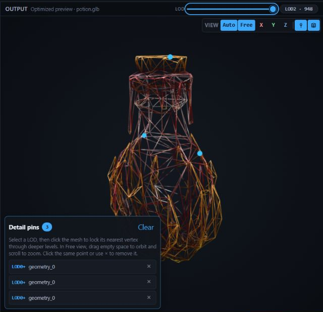

# MeshShift

MeshShift is an offline 3D asset conversion and optimization toolkit with a
local web UI, a Node.js CLI, and a reusable TypeScript API. It began as an
effort to add asset-processing capabilities to [Modly](https://modly3d.app/),
but grew into a standalone tool for converting assets between multiple 3D
formats and preparing them for real-time use.

Alongside format conversion, MeshShift can generate progressively lower-detail
(LOD) meshes, reproject source textures onto newly generated UV layouts, and
preserve artist-selected vertex pins as detail is reduced through deeper LOD
levels. Conversion and optimization happen locally through the bundled Assimp
WebAssembly runtime and browser-side processing; no model is uploaded to a
remote service.

## Formats

| Direction | Formats                                                             |
| --------- | ------------------------------------------------------------------- |
| Input     | GLB, glTF, FBX, OBJ, STL, PLY, Collada (`.dae`), 3D Studio (`.3ds`) |
| Output    | FBX, GLB, glTF, OBJ, STL, PLY, Collada (`.dae`)                     |

glTF and OBJ companion files are supported. Supply `.bin`, `.mtl`, and
referenced textures alongside the primary file.

## Documentation

- [Quick start and web app setup](docs/QUICK_START.md)
- [Initial browser walkthrough](docs/HOW_TO_USE.md)
- [CLI reference](docs/CLI.md)
- [Core TypeScript API](docs/API.md)
- [Architecture and preview pipeline](docs/ARCHITECTURE.md)
- [LOD generation, texture reprojection, and vertex pins](docs/LOD.md)
- [Format and feature matrix](docs/FORMAT_FEATURE_MATRIX.md)

## Desktop releases

GitHub Releases publish standalone desktop builds for Windows (`.exe`), macOS
(`.dmg`), and Linux (`.AppImage`). The Electron app packages the browser UI,
the Assimp WebAssembly runtime, and the Node host so the desktop conversion
path works offline. A portable CLI archive is also published for each
supported platform and includes its own Node.js runtime.

For local development, use `pnpm run desktop:dev`. To build distributable
artifacts locally, use `pnpm run desktop:dist`; CI performs the final signing,
notarization, checksum, and provenance steps for tagged releases.

## License

MeshShift is MIT licensed. See [THIRD_PARTY_NOTICES.md](THIRD_PARTY_NOTICES.md)
for the licenses and exact checksums of the redistributed Assimp WebAssembly
runtime.
