# ModelShift: initial walkthrough

This walkthrough covers the first browser workflow: open a model, set LOD triangle targets, generate an optimized preview, pin important vertices, and export the result.

## Before you start

1. Install dependencies with `pnpm install`.
2. Start ModelShift from the repository root with `pnpm dev` or `.\start.ps1`.
3. Open `http://localhost:5173/`.

ModelShift keeps the workflow local. Browser exports are written under the repository's `exports/` directory.

## 1. Open a model

Click **Choose files**, then select the primary model. For glTF or OBJ assets, select any referenced sidecar files in the same batch. The model appears in the **Input** viewer and the file is added to the conversion queue.

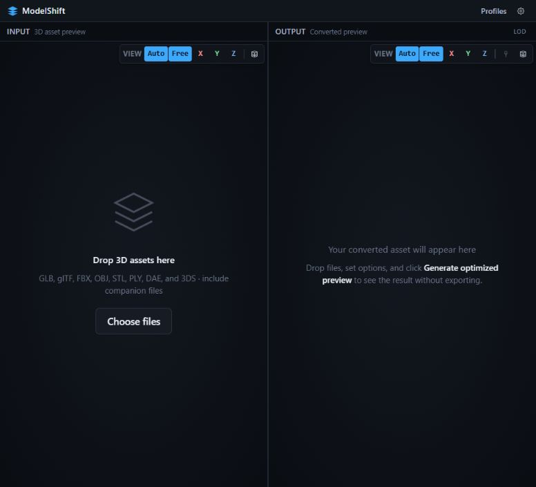

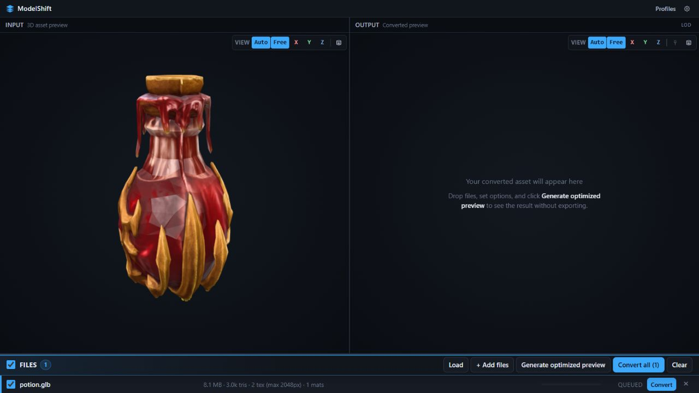

## 2. Set LOD triangle targets

Open **Profiles** and set **Generate LODs** to the number of additional levels you want. In this example, two levels are generated:

- **LOD1 target:** `1500`
- **LOD2 target:** `900`

These are absolute triangle targets per mesh. Leave a target at `0` to use ModelShift's automatic, quality-focused target. Keep the LOD levels you want to export checked in the **Files** area.

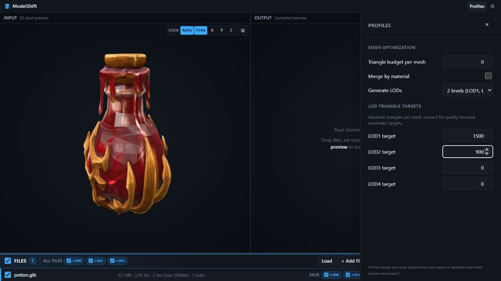

## 3. Generate the optimized preview

Click **Generate optimized preview**. The progress panel reports the active optimization phase while ModelShift prepares the geometry and generates the LODs.

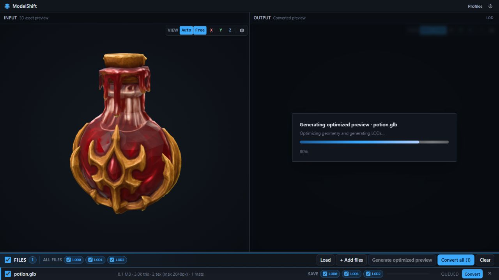

When it finishes, the **Output** viewer shows the optimized model and the LOD report. Use the LOD slider to inspect the generated levels.

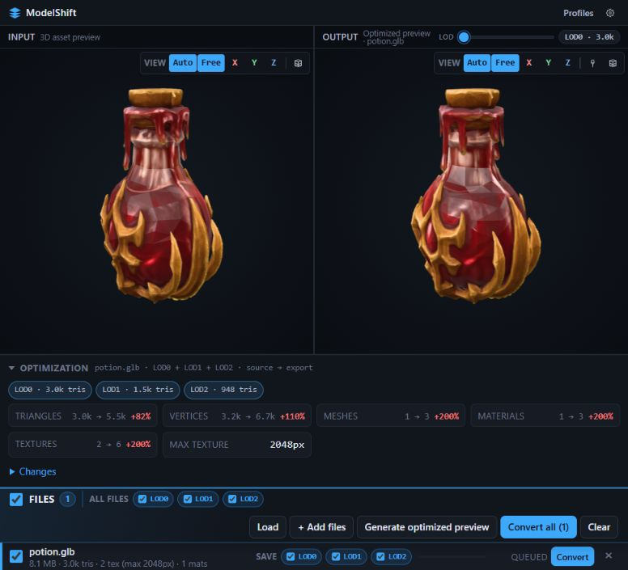

## 4. Pin important vertices

Click **Edit detail pins**, select the LOD that should retain the point, and click the model where the vertex matters. ModelShift locks the nearest vertex from that LOD through deeper levels. The pinned point appears in the **Detail pins** list.

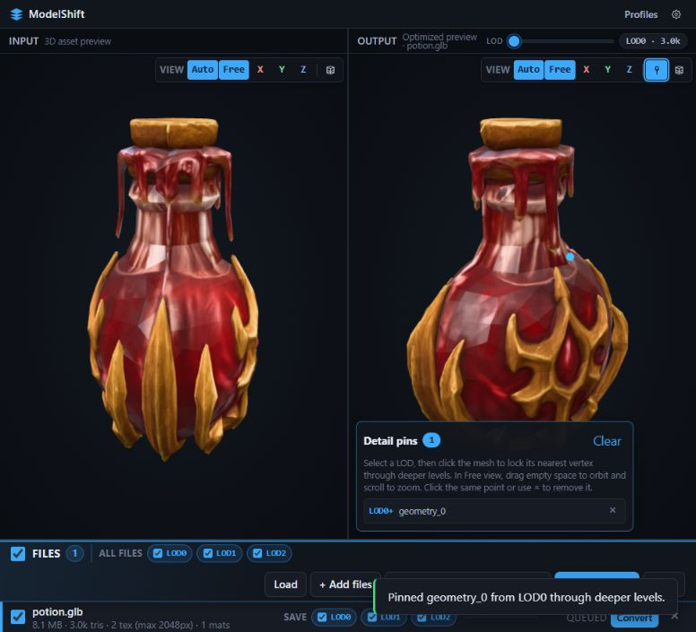

For precise placement, turn on the output viewer's **Toggle wireframe** control while **Edit detail pins** is active. This exposes the topology and makes it easier to place several pins on caps, edges, or other silhouette-critical areas. The example below shows three pins on the same model.

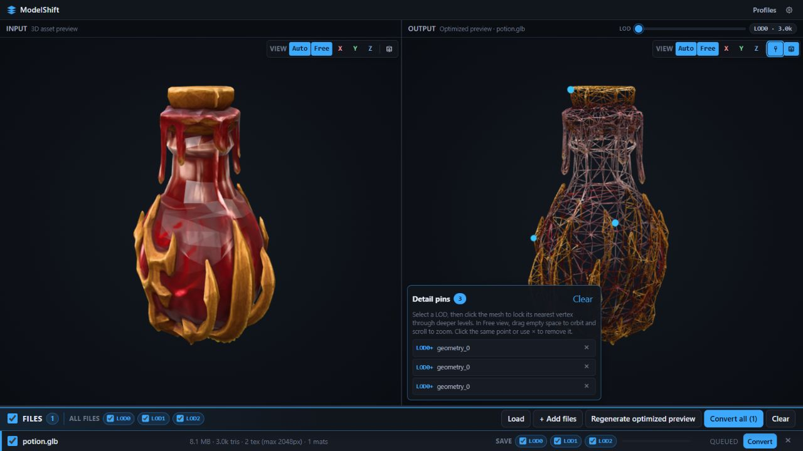

Use the **Preview level of detail** slider to compare the same pins across the generated levels. In this example, LOD0 is the original 3.0k-triangle mesh, LOD1 is reduced to 1.5k triangles, and LOD2 is reduced to 948 triangles. The blue markers and the **LOD0+** entries in the **Detail pins** list show that these pins are carried through the deeper levels.

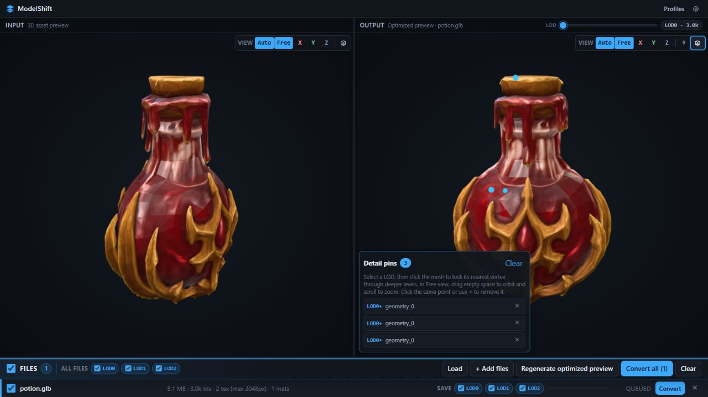

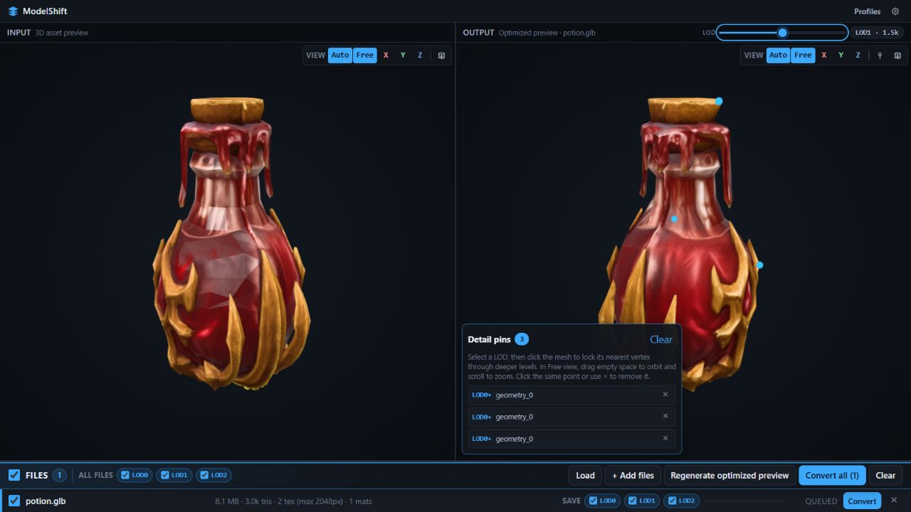

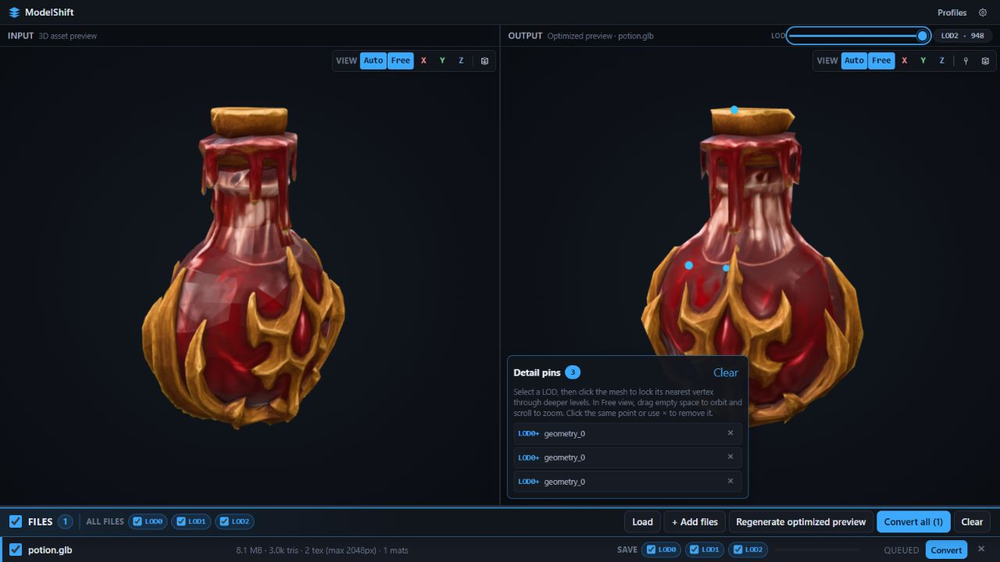

If you change a pin after preview generation, exit pin-edit mode and click **Regenerate optimized preview** so the cached optimization includes the new pin.

## 5. Export the model

Choose the output format in **Settings** if you do not want the default FBX export. Confirm the LOD save checkboxes, then click **Convert all** or the row's **Convert** button.

When the conversion completes, the queue shows **Done** and a **Save again** control. The browser writer saves the output beneath `exports/`; this example produces `exports/potion.fbx`.

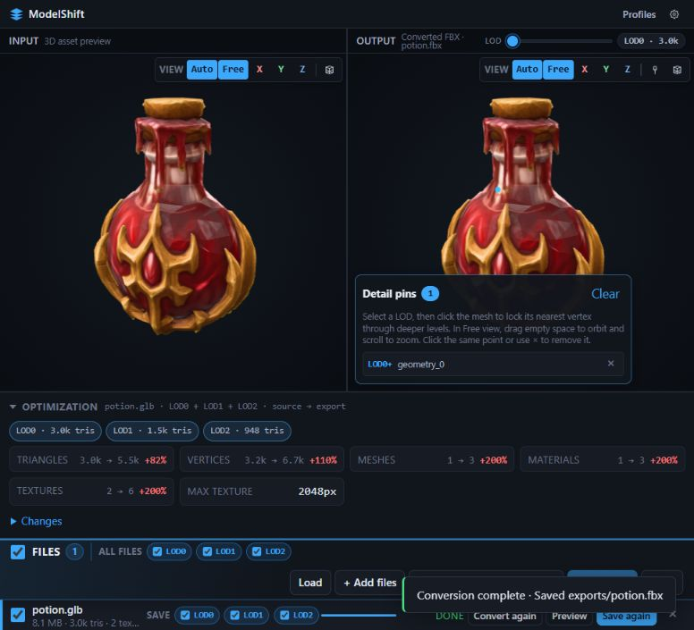

To export another format or change the LOD selection, update the settings and convert again. A changed optimization setting invalidates the cached preview, so generate the preview again before exporting.
